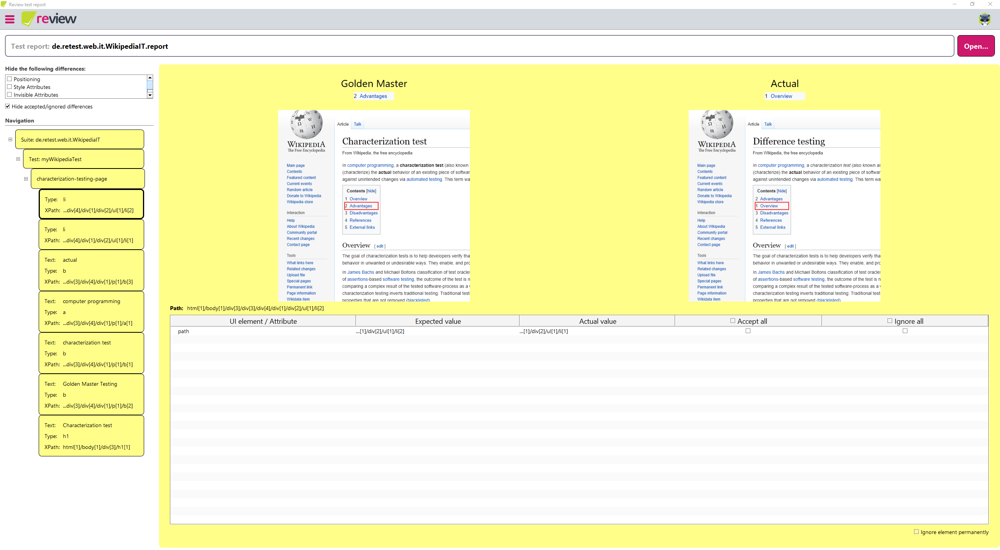
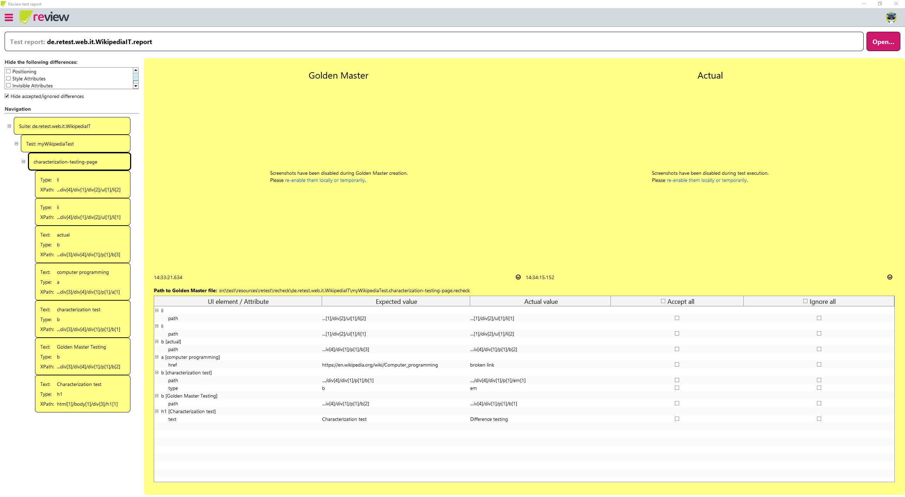

# Version 1.9.0

Welcome to version 1.9.0 of ***recheck***, ***recheck-web***, ***recheck.cli*** and ***review***. For more information, please refer to the specific changelogs.

We have developed some new features to improve your workflow:

1. [**Code healing**](#code-healing): Heal your broken tests automatically.
2. [**Ignore fallback**](#ignore-fallback): Ignore changes even if no project is available.
3. [**Zoom screenshots**](#zoom-screenshots): Focus on the element changed instead of the whole page.
4. [**Disabled screenshots**](#disabled-screenshots): Instantly show if screenshots have been disabled during testing.
5. And as always general [improvements](#improvements) and [bug fixes](#bug-fixes).

## Code healing

This feature is available with ***recheck-web*** and ***review*** (Standard). For more information, please refer to this [feature article](../recheck-web/healing.html).

While using ***recheck-web*** and the unbreakable feature, either via `UnbreakableDriver` or `RecheckDriver`, you may have encountered log messages similar to:

```plaintext
*************** recheck warning ***************
The HTML id attribute used for element identification changed from 'user' to 'username'.
retest identified the element based on the persisted Golden Master.
If you apply these changes to the Golden Master , your test de.retest.web.FormTest will break.
Use `By.id("username")` or `By.retestId("user")` to update your test FormTest.java:47.
```

Up until now, you had to do these changes manually as suggested by this message.

Firstly, ***recheck*** will now properly show the warnings in the concluding difference report for each test.

```plaintext
4 check(s) in 'de.retest.web.FormTest' found the following difference(s):
Test 'form_should_fill_in_user_and_password_and_redirect_to_dashboard' has 8 difference(s) in 4 state(s):
00 resulted in:
    input at 'html[1]/body[1]/div[1]/div[1]/form[1]/input[1]':
        id: expected="login", actual="btn-login"
        ...
    input at 'html[1]/body[1]/div[1]/div[1]/form[1]/div[1]/input[1]':
        id: expected="user", actual="username", breaks="FormTest.java:47"
...
02 resulted in:
    input at 'html[1]/body[1]/div[1]/div[1]/form[1]/input[1]':
        id: expected="login", actual="btn-login", breaks="FormTest.java:52"
        ...
...
```

Secondly, ***review*** (Standard) is now able to use these warnings and automatically heal your tests. To indicate that these changes will break your test, ***review*** will now display a appropriate warning, too. Note the selected line next to the "Accept" checkbox.


If you accept such a breaking change and apply your report, ***review*** will collect all warnings, try to find each affected test and lines and replace the identifier. Afterwards you can simply commit the updated Golden Masters as well as the updated tests without having to touch them manually. Note that in order for this to work, you must open the report from within your project.

> Code healing is an early feature and might not work for every use case. We would love to hear feedback and suggestions from you as we further develop this feature.

## Ignore fallback

This feature is available with ***recheck***, thus it works for both ***review*** and ***recheck.cli***. 

If you open a report, which does not reside within a project, you are now able to ignore changes. These changes are saved to `${user.home}/.retest/recheck.ignore`. This is useful if you, for example, open a report generated from the chrome extension or download it directly from ***rehub***. Note that you are not able to accept, since no project and thus no Golden Master could be found.


## Zoom screenshots

This feature is available in ***review***.

Viewing elements in a large web page causes these elements to be displayed very small. This is reflected within the screenshot and thus draws the corresponding rectangle around the small element, resulting for the change to be almost invisible in the displayed screenshot. With review such elements are now being zoomed to, showing the element and some context in the screenshot.



## Disabled screenshots

This feature is available in ***review***.

If you have screenshots disabled, you are now being told so instead of endlessly waiting for the screenshot to load. This works for all kind combinations&mdash;any screenshot not present will now instantly display:

1. Screenshots enabled.
2. Screenshots disabled.
3. Screenshots only enabled for Golden Master creation or only test execution.



## Improvements

* Mixing of implicit and explicit checking is now prevented with an exception as it produced unexpected behavior. This should resolve strange behavior if mixing `Recheck#check` with `AutocheckingDriver`. For more information, please check out the [documentation](https://docs.retest.de/recheck-web/introduction/usage/) (***recheck-web***).
* Disable reordering of table columns which made it difficult to reliably click the checkbox "Accept All" or "Ignore All" (***review***).

## Bug fixes

* Reduce the amount of attempts to find the project root (***recheck***).
* Fix nested `iframes` not being analyzed (***recheck-web***).