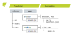
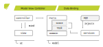

# Writing a Modular Typescript Project for a Web Application

When writing code for a project, structuring your code becomes more and more important the larger your project grows. This might begin with splitting one large file into multiple files, moving those files into packages (or similar constructs), and, finally, splitting your code basis into multiple, separate projects. 

### Structured Code Requires Thought

Structuring your code requires as much thought as a well designed API. You may design such an API within a single package or even class, thus requiring no (complex) structure. 

I would argue, that you begin to structure your code as early as possible, but paying attention that the structure does not cause too much overhead. Depending on your project you may want to improve the structure iteratively.

1. What do you expose from a class/package?
2. What is considered internal/public API?
3. How to structure your packages/project?

### Modular Code Does Not Mean Structured Code

I want to clarify, that modular code does not mean structured code; it means extensible and exchangeable. However, having your code properly structured helps a lot. With modules being exchangeable, it breaks the control flow of the application. This structuring makes it not only easier for the developers of the application to have well defined entry points, it makes the easier for external developers to customize such a module. It helps specifically to define, which packages or classes go together with the module and which of those a module can access. For example, a module may not have access to certain critical functions of the application and it can read, but should not be able to write certain functions.

## What is Modular Design?

[*Modular Design*](https://en.wikipedia.org/wiki/Modular_programming) describes the separation of of a program into smaller pieces, so called *modules*. A single module may be exchanged with an other modules of the same type. It depends on the application, if this happens at compile time or at runtime, known as *lifecycle*. A lifecycle may account for resource management or other initialization and deinitialization states, such that only the necessary resources for each active module is reserved, freeing it once a module gets unloaded. 

The implementation of a lifecycle is not necessary for each module, however, if implemented, it needs to be managed precisely to prevent any leaks when switching modules. The lifecycle can get quite complex, for example, if a module can declare dependencies to other modules. This declaration would need to be resolved (e.g. cyclic dependencies) with missing dependencies being handled by the lifecycle. Furthermore, dependent modules need to be started and stopped based on their dependencies being available.

Generally speaking, can each implementation of a specific interface be seen as module, as you may change one implementation for another and as long as the code that uses the interface is not aware of any specific implementation used. Therefore, I tend to consider two categories: 

1. *Providing modules* are modules that provide one or more services into a system. These services are used by the underlying program to implement a specific task.
2. *Consuming modules* are modules that use one or more services from the underlying system. It performs a given task, which can itself be seen as service.

## Motivation

Web applications allow you to bypass annoying platform-specific shortcomings like different path separators, line endings and UI looks. Instead the use a common language which is displayed in a browser, independent of the actual platform. However, they do so with with their own drawbacks&mdash;such as isolated sandbox mode and cross-browser compatibility.

Several cross-platform solutions (e.g. [Flutter](https://flutter.dev/), [Cordova](https://cordova.apache.org/) or [React Native](https://facebook.github.io/react-native/)) were developed over the past few years, some of which use web technologies as common ground. They try to emulate the operating systems' native UI elements and behavior, however, they still do not come close to an actual native application. This involves considerable performance deficits which involves the actual rendering and the access to device-specific interfaces such as the camera and microphone.

In the following article, I will explore different approaches that allow a cross-platform implementation based on web technologies. They should use a common code base with a modular architecture, such that each approach takes full advantage of the underlaying architecture. This is done to give an insight into the power of modular design.

*Please note that, same as the firstly mentioned cross-platform solutions, this still might not be the ultimate solution, but it is definitely a promising one.*

### Progressive Web Applications (PWA)

[*Progressive Web Applications (PWA)*](https://medium.com/@slightlylate/progressive-apps-escaping-tabs-without-losing-our-soul-3b93a8561955) are a way to install any browser-based web application onto your local machine or smartphone. Once installed, they will appear as a standard program, available via search and shortcut, and feature their own native window instead of being opened in a browser. Furthermore, they are available in offline mode while still synchronizing important updates from the online web application. With this feature, they have a very fast startup time, while asking for updates in the background to keep the information up to date.

There are several steps to perform to upgrade your web application to a PWA. This heavily depends on the browser used, but usually involves the following requirements:

1. Provide a `manifest.json`, which defines the appearance once installed (like icons and theme colors).
2. Provide icons, which are used for the applications' icon displayed as shortcut and taskbar.
3. Provide a `service-worker.js`, which is responsible for caching/answering responses made by the application to ensure offline availability.

In the recent months, PWAs gained more and more support throughout major browsers. It is planned in the [future](https://developers.google.com/web/updates/capabilities) to further close the gap to the native alternatives which include native file access, badging API and more.

### Electron

[*Electron*](https://electronjs.org/) provides the tools to develop cross platform applications with basic web technologies like HTML, JavaScript and CSS. It simply takes your web application and packages it with Chromium to a native desktop application. As such, it is very easy to build native desktop applications while still using the same code as the browser version. However, Electron additionally provides optional APIs to communicate directly with the underlaying operating systems, making it possible to avoid sandboxed environments and letting the application feel even more native.

You start by writing your main application (main process) code that manages the lifecycle of each window (renderer process). To create a window, you just load your `.html` from a file or directly from the web and are good to go.

## Exercise

I will develop an application that can be used within a browser, installed as PWA or as a native electron application. As stated above, they will use a modular design, where each application will provide their own module with the necessary services, optimizing and harnessing the full power of each approach. Note that I will only take a look at using modular TypeScript with this application. Further approaches might even adjust the HTML and CSS depending on the specific application used. That said, there will be two modules:

1. Browser: *The standard browser experience*. The application will be usable inside a browser. However, the user can also choose to install the application as PWA and use it offline.

2. Desktop: *The native application experience*. Electron provides the native desktop installation. While the overall look and feel will not be adjusted, thus having the same look as the browser version, it will use some native features.

In the following paragraphs I will only outline the basic principles used for the different aspects. I will take a basic look at the most important parts and outline each approach mentioned above which essentially form the functioning application. For detailed code insights, please refer to my [GitHub repository](https://github.com/diba1013/selenium-code).

## TypeScript

TypeScript 3.0 introduced [project references](https://www.typescriptlang.org/docs/handbook/project-references.html). They allow to structure your code into smaller packages, reference dependencies and build your project with a single command. Together with [Yarn](https://yarnpkg.com), they can be used to link project references together and define additional dependencies on a more granular level.

The following article distinguishes projects into *applications* and *libraries*. The application is the actual module and represents the executable that will be deployed, i.e. as browser or desktop application like described in the figure below. While they may contain additional code, their main purpose is to provide the module that will hook into the base application. This is done with the entry point (`crust.ts`) where it initializes the GUI. A library is only used internally and provides the code necessary for the applications to hook into. In the above paragraph, the libraries&mdash;most notably the UI library&mdash;provide the common code basis.



### Building a Monorepo

Suppose, we have a project structure as displayed in the figure above. Each internal library and modular application represent both a Yarn workspace and TypeScript project reference. They each have their own dependencies and reference each other in a hierarchical manner&mdash;both in Yarn as well as TypeScript. This means that the application references only the *UI* which exposes the underlaying libraries and dependencies. This more granular level of dependency management allows for a narrow dependency tree, which only needs updating on one level.

To realize this project layout, each library and application uses a `package.json` and a `tsconfig.json` to manage the configuration of each workspace or project reference. To unify some configuration for TypeScript projects, they each reference a parent `tsconfig.json` with additional configurations. For example, libraries need declarations (also called `.d.ts` files) to avoid compilation failures and enable type completion.

The top-level `tsconfig.json` references each application that needs to be built. Since it is outside of a Yarn workspace, its only purpose is to build the complete repository with one command. If you have a editor capable of understanding TypeScript (like Visual Studio Code), you can build each TypeScript Project independently.

### Referencing Projects

Libraries or Dependencies are referenced through the `dependencies` and `reference` in Yarn and Typescript respectively. However, for a monorepo to compile, you need to define additional properties.

package.json {.file-header}
```json
"name": "@diba1013/view",
"main": "dist/index.js",
"types": "dist/index.d.ts",
"dependencies": { 
    "@diba1013/core": "^1.0.0", 
    "@diba1013/model": "^1.0.0" 
}
```

A library must define the `main` and `types` property so that the TypeScript compiler can find the module and access its type definitions. This is not necessarily required for applications, however, it may help other tools if the `main` property is defined.

tsconfig.json {.file-header}
```json
"paths": {
    "@diba1013/core": [ "../core/src" ],
    "@diba1013/model": [ "../model/src" ],
},
"references": [
    { "path": "../core" },
    { "path": "../model" }
]
```

Use the `paths` property to map a arbitrary module path to an actual relative path. This will be used later for bundling a single JavaScript file that will be executed within a browser, where imports are not supported. For this reason, the module path must be the same as the name of the actual module.

crust.js {.file-header}
```ts
import { Lifecycle } from '@diba1013/model'
```

This setup allows to import members from the available libraries. In the above example, a service is imported that is exposed from the Model library.

## Model View Controller (MVC)

As stated above, structuring your code is important. This is most important in user interfaces, as they combine multiple aspects of software development:

1. Designing the actual user interface is already a challenge in itself, as you need to transform the vision of a user into usable principles and those into code.
2. Writing logic code that communicates with several systems (e.g. database) and does so in a responsive manner.
3. Doing the above repeatedly for multiple platforms (e.g. native, mobile, web).

To solve this complex problem, the [*Model View Controller (MVC)*](https://en.wikipedia.org/wiki/Model%E2%80%93view%E2%80%93controller) uses modular design to divide the user interface into three components or modules. Each component has a distinguished [responsibility](https://en.wikipedia.org/wiki/Single_responsibility_principle) and can be developed independently and in parallel, exposing only abstract interfaces to the other components. These components are typically divided into a minimum of two layers. As typical for a [multi-tiered architecture](https://en.wikipedia.org/wiki/Multitier_architecture), lower layers should never know the layers above, instead they should provide means to communicate anonymously (e.g. via a interface).

1. *Presentation Layer* builds the top-most layer and houses the actual user interface.

   * The *view* is responsible of displaying the data. The user interacts with this component.
   * The *controller* takes user interactions, transforms them and forwards them to the model, accepts the result, and updates the view. 
2. *Application Layer* builds the lower layer and houses the domain logic.

   * The *model* is responsible for the domain logic. That includes data management and processing, state management and validation.

The classic MVC is quite old and misunderstood. Thus [improved versions](https://martinfowler.com/eaaDev/uiArchs.html) have been developed, which rename the components and alter their functions. It is noteworthy, that an application cannot be abstracted to a single implementation of MVC, which is why an application should generally use several different implementations of MVC. 

### MVC in the Web

Depending on your point of view, you could argue that a client-server architecture is MVC, with the server as application layer and the browser as presentation layer. You then could consider the [render tree](https://developers.google.com/web/fundamentals/performance/critical-rendering-path/render-tree-construction) (DOM and CSSOM) as view and the JavaScript as controller. The above mentioned communication is done through HTTP requests or via web sockets, so that the server does not know the web application as such.

I will take another route and completely ignore anything that happens in the browser. As the title of this article suggest, I will focus solely on the TypeScript (i.e. JavaScript) side and outline the workings behind this lower point of view. As such, the figure below displays the same architecture; there is a presentation layer (UI) and an application layer (Model) which is implemented in the respective TypeScript projects as shown above. I will discuss each column separately.



### Data Binding

Within a multi-tiered architecture, the lower layer is not allowed to access the layers above. However, it still needs to notify about updates that happen within the layer, so that the layers above can update their content. To circumvent this issue, one can use the [*observer pattern*](https://en.wikipedia.org/wiki/Observer_pattern) for direct communication or the similar [*publish-subscribe pattern*](https://en.wikipedia.org/wiki/Publish%E2%80%93subscribe_pattern) for indirect communication. I will mainly discuss the first one.

Building on that pattern, there are two types of *data subjects*.[^1] Each subject can use any arbitrary data called `T` and is available either as mutable or immutable subject. As subjects in the observer pattern, they manage their observers and notify them about the update, giving precise information on what changed (i.e. their data) as they might not hold onto them. Thus a observer does not get updated through a generic `update()` function and then must gather the changed values, it directly receives the changed value. Such a registration of a observer to a subject yields a *subscription* which can be revoked, removing the observer from the registered subject.

1. *Data Storage* or *Container* (`Var<T>` or `Val<T>`): The datum is stored or cached and can be retrieved at any time. The container notifies new observers directly of the cached datum and any change thereafter.
2. *Data Processing* or *Stream* (`Source<T>` or `Flow<T>`): The datum is only available momentarily. It cannot be retrieved and has to be processed immediately. The stream only notifies observers whenever a new datum is available.

This opens up multiple advantages. The subjects can be chained via an expression (e.g. mapping to another data type or filtering data based on a condition), resulting in a *chained subject*. This is essentially nothing else as subscribing to the parent and performing the expression with the received data and storing or processing the result. It should be noted, that chained subjects should never be mutable as this would destroy the contract of the chain; a parent only updates the child, the child itself does not update on its own. Furthermore, the chains are lazily computed, subscribing to their parents only if they themselves have any subscriptions, and automatically stopping once all subscriptions have been removed. That means, when a chain is built from a data subject, no action is executed; if a subscription takes place on the resulting chain subject, the chain is assembled from bottom to top and data can flow&mdash;however, it depends on the subject on how exactly data flows. This saves computation time, prevents huge update waves and removes potential memory leaks since they revoke their subscription as soon as possible.

Using the observer pattern, the view can synchronize data directly from/to the model. This is called [*data binding*](https://en.wikipedia.org/wiki/Data_binding). It essentially connects two or more data subjects together. Data may flow in one or both directions, blocking the opposite direction during an update to prevent update loops. The receiving end(s) must be mutable, so that the value can be written to. However, care should always be taken, on which side takes priority over the other as to synchronize the values upon initial binding. When initializing such a binding it is important which of both values has the priority, as it defines the resulting value.

The view (in some implementations the controller) registers such a binding directly on the model. Consequently updates from the model are directly fed to the view while updates from the view&mdash;ideally after input validation and sanitization&mdash;are directly fed to the model. Since the model has the authority as it holds the logic code, its value should always be preferred, thus updating the view upon binding.

### Ports

The presentation layer may only special entry points to access the underlying application layer, called *Ports*. This has two main purposes: *structuring code* and *single access*. Ports may explicitly not be singular; an application can have multiple dedicated ports for login, options or other purposes.

The structuring of the code is strongly coupled with the hiding of the underlying implementation, but as well as to provide the single access. The application layer shall&mdash;as described by the figure above&mdash;only expose the domain model, services and the actual ports. The domain model and services shall only be exposed so that the types are available for implementation. The actual instances (like users or database connections) shall not be accessible, but instead handled by the ports.

The single access point through wich all communication must go. This may seem like a bottleneck at first, but it is really not. If the application layer is a server, the port might reference the actual server with its REST API, a centralized API Gateway or similar. For TypeScript, this only means an exported member called `Port`. 

#### What Do Ports Do?

The short answer: They execute requests (*actions*) from the presentation layer. The long answer: They manage the state of the application, validate actions, enqueue tasks and update data. I prefer to expose the data as containers, such that data binding can be applied, carefully choosing if said data is mutable. This automatically exposes the get (and set) action of the respective data, allowing an action to be queried (e.g. "type username" sets the username in the `LoginPort`). However, it may not be allowed to perform every action within every state. Additional actions may be defined, that are separate from accessing the data but may themselves use said data to perform their action. For example, a login action may use the username and password provided, but it is not automatically triggered if a container is changed and thus must be called explicitly (e.g. on the click of a button).

If you use explicit states (i.e. a state machine), each state should refer to an actual page inside the GUI; for example a login state should refer to the login page. With each page, there are possible actions that a user can perform (e.g. type username, type password and login); other actions shall be denied. However, certain actions require a certain sub-state within the page. For example, the login action requires both the username and the password to be present; the actual authentication happens later. More importantly, the user is not permitted to do anything with the application as long as he is not authenticated, i.e. completed the login process.

Once an action was validated, it is passed into the system, called *task*. Each action has its corresponding task that is executed and queries necessary services. The "type username" task might query the database service for such a username and return if such a user exists. The "login" task queries the authentication service and checks username and password, forwarding to the next state if successful or to an error state if invalid. A task has full access to the system, but should always have a result that updates the corresponding data within a port.

### Dependency Injection (DI)

[*Dependency Injection*](https://en.wikipedia.org/wiki/Dependency_injection) is a pattern that manages the dependencies of an object (or *client*). It decouples the need and knowledge to create a specific object, instead it supplies the necessary dependencies to clients created. This technique is tightly coupled with modular programming, since the client itself does not care anymore which concrete module (i.e. dependency) it uses; it can be exchanged by any implementation.

* A *service* that is available (ideally as interface); its implementations must comply with the contract concluded. If there are multiple implementations for a service within a scope, a resolution strategy must be formulated.
* A *client* that uses multiple services, specified as dependency. Dependencies may have different resolution strategies like optional or required, which affect the behavior of the client. A client itself can be a service.
* The *provider* creates the services and serves as decoupled factory. This may be implicit, such that the injector creates the services via available constructors. 
* The main role holds the *injector* which manages services within a scope and creates clients. In the simplest case, this is a lookup table which maps a dependency to a service. The services may specify their lifecycle, i.e. if they must only be created once or with every injection.

It is advisable to manage the scope of a dependency. Ideally an application that uses dependency injection has multiple scopes, each scope may be used for different parts of the application. That is, so that critical services are not accidentally exposed or bypassed.

When including dependency injection, you do not need to need to use it everywhere; you may use it only in specific layers. Depending on the complexity of your software, it might benefit from DI or create overhead, since it encourages [single responsibility](https://en.wikipedia.org/wiki/Single_responsibility_principle).

## Application

But what role does all this play in the final application? Well, the TypeScript project structure should be fairly obvious. I split the code into multiple projects according to the multitier architecture to provide the common code basis for the applications, wich each have its own separate project. For the rest, I will put the little puzzle pieces together, starting at the application. This is done with three steps.

1. Each application provides the module via `crust.ts` and an exported function from the view library to initialize it. This file is the entry point of the application and will be bundled to `index.js`. It defines required services or overwrites some optional services. Thus modules are defined at compile time, have no knowledge of other applications and thus need no explicit lifecycle.
2. The view library initializes the DI injector with the services from the module. This takes the services from the module and registers them as available dependency. Since the services are relatively simple, they are passed as instance thus they must not be created by the provider&mdash;or more accurately the module serves as provider. This eliminates the need for a separate service scope. Afterwards it initializes clients (like the `Port`), some of them implicitly.
3. The view library initializes the GUI via MVC and a `WindowView` with its `WindowController`. Upon initialization, this `WindowView` further identifies smaller views (e.g. navigation, header, footer, ...) with their controllers and initializes them. The `WindowController` hooks into the UI, extracts the necessary elements, initializes the databinding to the ports and takes care of other things, the view is not able to. The MVC components are clients and created by the injector, so that they have full access to the ports and its services.

[^1]: Similar reactive approaches have been developed on a generic level with [ReactiveX](http://reactivex.io/) and for JavaFX GUIs with [ReactFX](https://github.com/TomasMikula/ReactFX).
